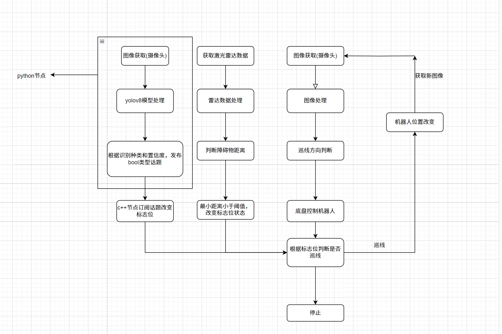

🤖 基于 ROS 2 的视觉巡线与自主导航机器人

📖 项目简介

基于 ROS 2 Humble 开发的麦克纳姆轮移动机器人，集成视觉巡线、YOLOv8 目标检测、激光雷达避障、SLAM 建图和 Nav2 自主导航等功能。

通过摄像头、激光雷达、IMU 和里程计等多源数据，实现机器人从环境感知 → 任务判断 → 运动控制 → 自主导航的完整闭环，并完成实体机器人部署与实测。

✨ 核心功能

🚗 视觉巡线：基于 OpenCV 提取道路特征，结合 PID 实现机器人稳定巡线。

🎯 目标检测：基于 YOLOv8 识别 Stop 标志等目标，并根据检测结果触发停车等行为。

🛡️ 雷达避障：利用激光雷达实时检测障碍物，实现避障。

🗺️ SLAM 建图：基于 SLAM Toolbox 完成二维环境地图构建与机器人定位。

🧭 自主导航：基于 Nav2 实现路径规划及自主导航。

🏗️ 系统架构

🛠️ 技术栈

机器人框架： ROS 2 Humble、Nav2、SLAM Toolbox、TF2

视觉： OpenCV、YOLOv8

运动控制： PID

传感器： 激光雷达、IMU、摄像头

仿真与调试： Stage_ros2、RViz2、rqt

开发环境： C++、Python、Ubuntu

🌟 项目亮点

多功能融合： 将视觉巡线、目标检测、雷达避障与自主导航集成于同一机器人平台。

感知—决策—控制闭环： 将视觉和雷达感知结果与机器人运动控制联动，实现自动巡线、识别stop停车及雷达避障。

完整导航链路： 覆盖传感器数据处理、SLAM 建图、定位、路径规划和底盘运动控制。

💻 部署要求

操作系统： Ubuntu 22.04

ROS 版本： ROS 2 Humble

编程语言： Python 3、C++

计算机视觉： OpenCV (C++)

目标检测： Ultralytics YOLOv8

SLAM： SLAM Toolbox

自主导航： Nav2

桥接包：ros-humble-cv-bridge

